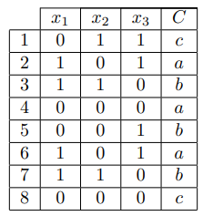

# Práctica 5 - Introducción a los Sistemas Inteligentes 

## Modelos probabilísticos

### Sebastián Escandón Flórez

### 1. Calcule las probabilidades condicionales necesarias para un modelo naïve Bayes.  

- #### Probabilidades por clase:  
    - P(a) = 3/8  
    - P(b) = 3/8
    - P(c) = 2/8
- #### Probabilidades por atributos:
    - a
      - P(x1 = 0 | a) = 2/3
      - P(x1 = 1 | a) = 1/3
      - P(x2 = 0 | a) = 3/3
      - P(x2 = 1 | a) = 0/3
      - P(x3 = 0 | a) = 1/3
      - P(x3 = 1 | a) = 2/3
    - b
      - P(x1 = 0 | b) = 1/3
      - P(x1 = 1 | b) = 2/3
      - P(x2 = 0 | b) = 1/3
      - P(x2 = 1 | b) = 2/3
      - P(x3 = 0 | b) = 2/3
      - P(x3 = 1 | b) = 1/3
    - c
      - P(x1 = 0 | c) = 2/2
      - P(x1 = 1 | c) = 0/2
      - P(x2 = 0 | c) = 1/2
      - P(x2 = 1 | c) = 1/2
      - P(x3 = 0 | c) = 1/2
      - P(x3 = 1 | c) = 1/2

### 2. Clasifique el ejemplo *x = (0, 0, 1)*.

#### P(Clase | X) ∝ P(Clase) ⋅ P(x1 = 0 | Clase) ⋅ P(x2 = 0 | Clase) ⋅ P(x3 = 1 | Clase)

- Para a:  
    P(a | (0,0,1)) = 3/8 ⋅ 2/3 ⋅ 3/3 ⋅ 2/3 = 1/6
- Para b:  
    P(b | (0,0,1)) = 3/8 ⋅ 1/3 ⋅ 1/3 ⋅ 1/3 = 1/72
- Para c:  
    P(c | (0,0,1)) = 2/8 ⋅ 2/2 ⋅ 1/2 ⋅ 1/2 = 1/16

### 3. Calcule la siguiente probabilidad de manera exacta: *P(C = a|x = (1, 1, 0))*

P(clase|x) = [P(clase) × P(x|clase)] / P(x)

Siendo P(x) = [P(a) ⋅ P(x|a)] + [P(b) ⋅ P(x|b)] + [P(c) ⋅ P(x|c)]

Entonces:  

- P(a) ⋅ P(x|a) = 3/8 ⋅ 1/3 ⋅ 0 ⋅ 1/3 = 0
- P(b) ⋅ P(x|b) = 3/8 ⋅ 2/3 ⋅ 2/3 ⋅ 2/3 = 1/9
- P(c) ⋅ P(x|c) = 2/8 ⋅ 0 ⋅ 1/2 ⋅ 1/2 = 0

P(x) = 0 + 1/9 + 0

P(C = a|x = (1, 1, 0)) = 0 / (1/9) = 0

